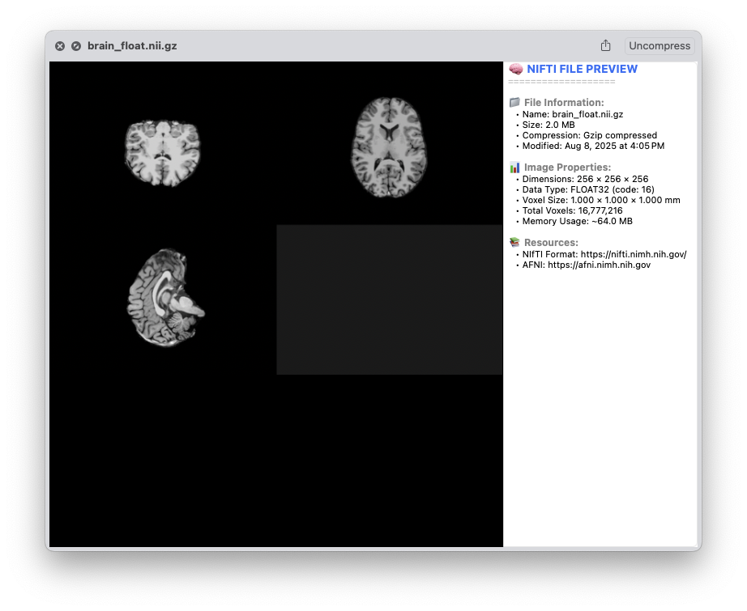

# NIfTIViewQL



### What

A quick and *very* messy Quick Look Preview Extension for macOS 15 and beyond. 

Due to changes in macOS 15, (non-Apple) Quick Look plugins are part of apps. The NIFTIViewQL 
app is very simple, and just needs to be installed (/Applications) to enable NIfTI Quick Look 
in Finder. 

Rough Development process:
1. Link nifti_clib to xcode and run as command line
2. Code GUI using Objective-C to open/read NIfTI files
3. Create Quick Look Preview target in Xcode
4. Fail at #3 multiple times due to macOS 15 API changes
5. Turn to AI to for help, fail more times
6. Eventually things start to work
7. Start sharing things on Github

---

### INSTALL

Currently *requires* you to have Xcode installed on your system.

New way to build with Makefile (handles dependencies):
```
git clone https://github.com/pmolfese/NIfTIViewQL
cd NIfTIViewQL
make all
open /Applications/NIfTIViewQL.app
#Close the app (forever?) and Finder Quick Look (space) will work
```

Enjoy Quick Look Previews of NIfTI files! Select any .nii or .nii.gz file
press the <space> button and you should get a preview of the contents.

---

If you find this helpful, please give us a Star!

Very open to feature suggestions and PRs.
